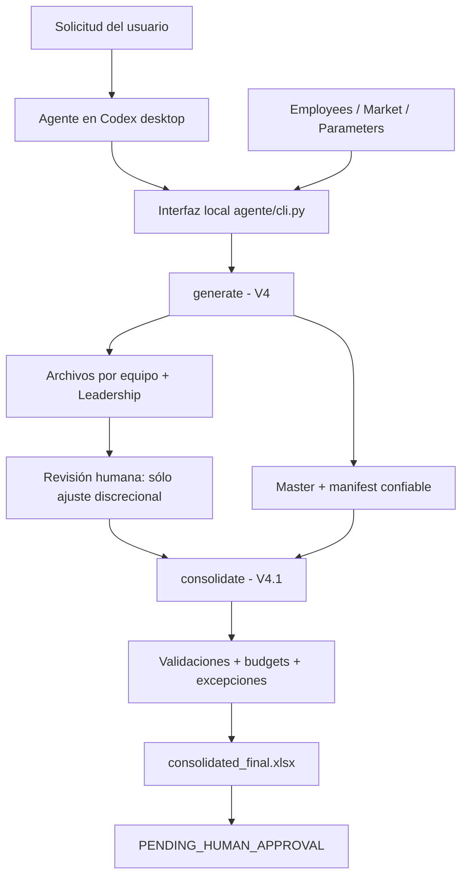

# Salary Review Agent — Trabajo Final

Trabajo Final de **Creación de Agentes de IA — MBA UCEMA**. El proyecto implementa un sistema agéntico para asistir un ciclo de revisión salarial de población fuera de convenio, combinando coordinación por IA, cálculo determinístico, archivos Excel protegidos, revisión humana acotada, controles de budget y aprobación final humana.

La lógica salarial no queda librada al modelo. El agente interpreta la solicitud, elige la operación, invoca una herramienta local, lee resultados estructurados, comunica excepciones y solicita intervención humana cuando corresponde. Los cálculos de porcentajes, redondeos, compa-ratios, caps y budgets se ejecutan en código determinístico.

**Estado actual:** las tres corridas finales están ejecutadas y documentadas. La Corrida 2 produjo una falla real al recibir un archivo guardado en Microsoft Excel; esa falla se preservó, se corrigió mediante V4.1 y se volvió a ejecutar sobre exactamente los mismos archivos reviewed en Corrida 3. La aprobación final continúa `PENDING_HUMAN_APPROVAL`.

> Los datos publicados son completamente sintéticos. No se incorporan salarios reales ni referencias propietarias. Esto protege confidencialidad en un repositorio público, pero se declara como una desviación consciente del requisito literal de “entradas reales” de la consigna.

## Lectura rápida para evaluación

1. [DECISIONES.md](DECISIONES.md): alcance, evolución V1 → V4 → V4.1, fallas y decisiones.
2. [prompts/system_prompt.md](prompts/system_prompt.md) y [prompts/user_prompt.md](prompts/user_prompt.md): contrato del agente.
3. [corridas/](corridas/): tres ejecuciones reales con inputs, outputs, fechas, hashes, logs y metadata de uso.
4. [docs/SUPERVISION.md](docs/SUPERVISION.md) y [docs/GOBIERNO_Y_RIESGO.md](docs/GOBIERNO_Y_RIESGO.md): nivel L2, responsabilidades y riesgos.
5. [docs/ANALISIS_ECONOMICO.md](docs/ANALISIS_ECONOMICO.md) y [docs/METADATA_USO_CODEX.md](docs/METADATA_USO_CODEX.md): tokens observados, costo y criterio de modelo.
6. [docs/REPRODUCCION.md](docs/REPRODUCCION.md): reconstrucción técnica.
7. [docs/CHECKLIST_RUBRICA.md](docs/CHECKLIST_RUBRICA.md): mapeo contra la rúbrica.

## 1. Problema y alcance

Un ciclo salarial requiere aplicar reglas consistentes a muchas personas, respetar presupuestos, preservar trazabilidad y permitir discreción humana sin perder control. El sistema automatiza la preparación y consolidación de propuestas, pero no reemplaza la decisión salarial humana.

La idea inicial incluía salary review y bonus anual. Se redujo deliberadamente el alcance a **salary review de población fuera de convenio** para mantener un sistema acotado pero completo. La muestra pública contiene **18 personas sintéticas: 15 empleados y 3 líderes** y contempla promociones, progresiones, mérito, mercado, redondeo, budgets por equipo y un pool separado de Leadership.

Los componentes `General`, `Promotion` y `Progression` son protegidos. `Merit` y `Market` se calculan según reglas parametrizadas. El salario se redondea a ARS 100. Los líderes no revisan su propio salario. El ajuste discrecional humano se registra por separado y sólo impacta `Final`, no reescribe la propuesta del sistema.

## 2. Qué hace el agente

El contrato final está dividido en `system prompt` y `user prompt` y utiliza las seis piezas trabajadas en clase: **Rol, Contexto, Tarea, Restricciones, Formato y Ejemplos**.

El agente puede coordinar tres operaciones:

- `verify`: comprobar referencias, hashes y dependencias;
- `generate`: generar la propuesta, master y archivos de revisión;
- `consolidate`: validar devoluciones, detectar cambios protegidos, recalcular Final y budgets y generar el consolidado.

La salida del agente es estructurada e incluye estado, inputs procesados, outputs, excepciones, budgets, archivos de revisión, estado de aprobación y próximo paso requerido.

## 3. Arquitectura



| Componente | Responsabilidad | Límite |
|---|---|---|
| Agente en el host | Interpretar la tarea, elegir operación, invocar herramienta y comunicar resultados | No inventa salarios ni aprueba |
| `agente/cli.py` | Preparar ejecución, verificar fuentes, invocar workflow y emitir reporte JSON | No decide política salarial |
| V4 / V4.1 | Cálculos, redondeo, cap, protección, budgets y consolidación | No decide ajustes humanos |
| Revisor humano | Revisar población y editar sólo `Discretionary Adjustment %` | No modifica la propuesta protegida |
| Compensation / autoridad | Resolver excepciones y aprobar el ciclo | La identidad real no se inventa en el repositorio |

## 4. Cómo se construyó e iteró

V1 implementó la lógica inicial. Las primeras pruebas mostraron que Market podía sobrecompensar después de Merit y que existían problemas de precisión.

V2 cambió las reglas de Market: se utiliza la posición destino y Market sólo cubre el gap restante hasta la referencia.

V3 agregó la política de redondeo: salarios en múltiplos de ARS 100, porcentajes con dos decimales y corrección de `X` en pasos de 0,01 pp para no exceder budget.

V4 convirtió el cálculo en un workflow operativo: archivos separados por revisor, pool Leadership, única columna editable, ajuste discrecional, protección, manifest confiable, consolidación y controles de integridad.

V4.1 nació de una falla real en Corrida 2. Microsoft Excel reserializó referencias equivalentes de fórmula (`'Detail'!` → `Detail!` y `'Summary'!` → `Summary!`). V4 comparaba strings exactos y produjo falsos positivos. V4.1 normaliza exclusivamente esas dos representaciones opcionales sin ignorar cambios de dirección, operador, constante, hoja, strings, referencias externas ni otras diferencias semánticas. La V4 histórica permanece intacta.

El detalle de decisiones, errores textuales y cambios de alcance está en [DECISIONES.md](DECISIONES.md).

## 5. Tres corridas finales

### Corrida 1 — generación

`generate` terminó con estado **`GENERATED_WITH_EXCEPTIONS`** y exit code 0. Generó master, tres archivos de equipo, archivo Leadership, manifest y validación. Detectó una referencia de mercado faltante para B004 y un budget protegido insuficiente en Team Gamma. No hubo revisión humana ni consolidación. El estado quedó `PENDING_HUMAN_APPROVAL`.

Evidencia: [corrida_01](corridas/corrida_01/registro.json).

### Corrida 2 — intervención humana y rechazo

Un humano abrió `team_L-A.xlsx` en Microsoft Excel y agregó **+1,00 punto porcentual** de `Discretionary Adjustment %` a A001. El agente no decidió ni escribió ese ajuste.

La consolidación se ejecutó realmente, pero V4 la rechazó con **13 `PROTECTED_FIELD_CHANGED`**. La causa observada fue una diferencia de serialización de fórmulas introducida por Excel, no una modificación semántica de los campos protegidos. La falla se preservó sin reescribirla. No se generó un consolidado válido.

Evidencia: [corrida_02](corridas/corrida_02/registro.json).

### Corrida 3 — mismo input, V4.1

Se utilizaron **exactamente los mismos cuatro archivos reviewed de Corrida 2, verificados por hash**. No se modificó nuevamente el Excel humano.

V4.1 consolidó con estado **`CONSOLIDATED_WITH_EXCEPTIONS`**, exit code 0. Se generaron `consolidated_final.xlsx` y `validation_exceptions.json`, sin errores de integridad por las diferencias de comillas.

Para A001:

- Proposed Salary: **ARS 1.923.600**;
- ajuste humano: **+1,00 pp**;
- Final Salary: **ARS 1.937.600**;
- Final Increase: **38,40%**;
- Final Compa Ratio: **0,897037...**.

El ajuste llevó a Team Alpha a **ARS 11.534.000** frente a un máximo de **ARS 11.520.000**, exceso de **ARS 14.000**. El sistema informó `BUDGET_EXCEEDED` y no corrigió el ajuste automáticamente. Team Gamma mantuvo su exceso de ARS 522.000. Beta y Leadership quedaron dentro de budget.

Evidencia: [corrida_03](corridas/corrida_03/registro.json).

## 6. Supervisión humana

El sistema opera en un esquema **L2** definido operativamente para este proyecto: el agente y las herramientas ejecutan trabajo y controles, pero una persona conserva la decisión final.

Los puntos de intervención son deliberados:

1. Compensation valida inputs y parámetros antes de generar.
2. El sistema genera propuestas y archivos de revisión.
3. El líder puede editar únicamente el ajuste discrecional de su población.
4. El sistema consolida y reporta excesos o alteraciones.
5. Compensation resuelve excepciones y la autoridad autorizada aprueba fuera del motor.

Un budget `OK` nunca equivale a aprobación. Todas las corridas conservan `PENDING_HUMAN_APPROVAL`.

## 7. Economía y modelo

Una auditoría posterior de la metadata local de Codex, realizada sin reejecutar corridas, identificó de manera verificable el modelo **`gpt-6-astra` con `effort: low`** y los tokens de los turnos completos asociados a cada ejecución:

| Corrida | Input | Cached input | Output | Total |
|---|---:|---:|---:|---:|
| 1 | 3.874.830 | 3.833.728 | 19.644 | 3.894.474 |
| 2 | 1.265.275 | 1.221.632 | 13.851 | 1.279.126 |
| 3 | 1.622.409 | 1.600.128 | 9.627 | 1.632.036 |

La medición corresponde al **turno completo de Codex**, incluyendo contexto, coordinación, herramientas, validación y documentación; no existe una separación verificable que permita atribuir tokens exclusivamente al subprocess salarial.

No se compraron créditos ni se pagó uso adicional: se utilizaron extends disponibles. El **desembolso marginal de caja observado fue 0** para las tres corridas. Esto no significa costo económico total cero: suscripción, equipo, tiempo humano, mantenimiento y seguridad son costos distintos.

La elección de `gpt-6-astra` con effort `low` es consistente con el criterio de usar una configuración liviana porque la matemática crítica se ejecuta en código determinístico. No se afirma que sea el mínimo absoluto posible porque no se hizo un benchmark comparativo.

Detalle y fuente: [docs/ANALISIS_ECONOMICO.md](docs/ANALISIS_ECONOMICO.md) y [docs/METADATA_USO_CODEX.md](docs/METADATA_USO_CODEX.md).

## 8. Reproducción

El paquete actual se evalúa dentro de `Trabajo-Final/` y reutiliza fuentes V4 que viven en `Entrega-2/v4/`. Por eso, en esta rama debe clonarse el repositorio completo; copiar sólo `Trabajo-Final/` no alcanza.

Con Python, `openpyxl`, Node y `@oai/artifact-tool` disponibles:

```powershell
python agente/cli.py verify
$env:SALARY_REVIEW_PASSWORD = 'DEMO-only'
python agente/cli.py generate --output ejecuciones/generacion_01 --synthetic-data
```

Para consolidar:

```powershell
python agente/cli.py consolidate --original ejecuciones/generacion_01/artifacts --reviewed ejecuciones/devoluciones_01 --output ejecuciones/consolidacion_01 --synthetic-data
```

La guía completa está en [docs/REPRODUCCION.md](docs/REPRODUCCION.md).

Para la entrega académica final, este contenido se promoverá a la raíz de un repositorio público limpio y se incluirán las dependencias V4 necesarias para que no dependa de una carpeta hermana.

## 9. Gobierno y limitaciones

- Los datos públicos son sintéticos; no se presentan como salarios reales.
- La protección de Excel previene modificaciones accidentales, pero **no es cifrado ni control de acceso**.
- El `reviewer_id` es routing sintético; no autentica identidad.
- El master y manifest deben permanecer en almacenamiento confiable.
- Una referencia de mercado presente pero conceptualmente incorrecta requiere revisión humana.
- Los excesos de budget se reportan; el sistema no recorta componentes protegidos ni ajustes humanos para producir un `OK` artificial.
- No hay envío automático de emails, integración con HRIS, Power BI, bonus ni aprobación automática.
- No se publican contraseñas ni credenciales.
- No se afirma uso en producción.

La matriz completa se encuentra en [docs/GOBIERNO_Y_RIESGO.md](docs/GOBIERNO_Y_RIESGO.md).

## 10. Qué aprendí y qué falta

El aprendizaje principal fue que un proceso conocido por Compensation contiene muchas decisiones implícitas que deben convertirse en reglas explícitas y auditables. El trabajo también mostró que una validación técnicamente razonable puede fallar frente a comportamiento real de Excel: la Corrida 2 obligó a distinguir entre equivalencia de representación y manipulación semántica sin debilitar el control.

La evidencia técnica y académica principal ya está construida: sistema, proceso, tres corridas, falla real, corrección, supervisión, gobierno, tokens y análisis económico. Antes de entregar resta ejecutar la revisión final con el evaluador y publicar el contenido en un repositorio final con la estructura obligatoria en la raíz.
