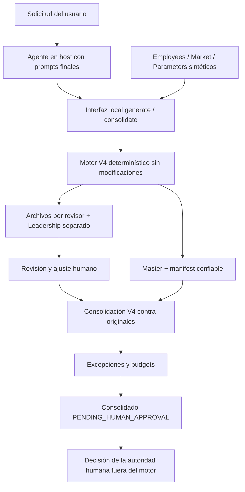

# Salary Review Agent — Trabajo Final

Borrador factual para la materia Creación de Agentes de IA, MBA UCEMA. Este proyecto coordina un ciclo de revisión salarial de población fuera de convenio con cálculo determinístico, revisión humana acotada y aprobación final pendiente.

**Estado de la entrega:** V4 técnica validada e integrada a `main` mediante el [PR #4](https://github.com/leonardoiannello-pixel/Clase-UCEMA/pull/4). Este paquete agrega contrato de agente, interfaz local y documentación. Las tres corridas instrumentadas del agente final y la medición de costos LLM siguen pendientes. No hay evidencia de producción ni de procesamiento de salarios reales.

## Lectura rápida para evaluación

1. [Decisiones y evolución V1–V4](DECISIONES.md).
2. [System prompt de seis piezas](prompts/system_prompt.md) y [solicitud de ejecución](prompts/user_prompt.md).
3. [Reproducción](docs/REPRODUCCION.md), [validación técnica](docs/VALIDACION_TECNICA.md) y [demo sintética existente](corridas/demo_sintetica/README.md).
4. [Supervisión L2](docs/SUPERVISION.md), [gobierno y riesgo](docs/GOBIERNO_Y_RIESGO.md), [análisis económico](docs/ANALISIS_ECONOMICO.md).
5. [Checklist de rúbrica y pendientes](docs/CHECKLIST_RUBRICA.md).

## Problema y alcance

Un ciclo salarial requiere aplicar reglas consistentes, respetar presupuestos, separar decisiones automáticas y humanas y detectar alteraciones al recibir archivos de revisión. El sistema prepara esa propuesta y controla su devolución. No reemplaza la autoridad salarial ni define políticas de Compensation.

La muestra pública tiene 18 personas sintéticas: 15 empleados y 3 líderes. General, Promotion y Progression son protegidos; Merit y Market se calculan según las reglas V4. Los salarios se redondean a ARS 100. Leadership se procesa aparte y utiliza su propio budget DEMO. Los parámetros discrecionales DEMO no son recomendaciones de negocio.

## Por qué se plantea como agente

El contrato del agente exige interpretar la solicitud, elegir entre verificar/generar/consolidar, invocar herramientas, leer resultados, reportar excepciones y pedir la intervención humana que falta. El sistema completo incluye esa coordinación, la herramienta determinística y la revisión humana.

La capa de IA está especificada en los prompts para un host que pueda invocar herramientas. La interfaz Python no interpreta lenguaje natural ni llama a un modelo. No se afirma que exista aquí un orquestador LLM autónomo instrumentado: falta ejecutar y registrar las tres corridas finales con el host/modelo elegido. El trabajo previo se desarrolló con asistencia de IA, lo que no sustituye esas evidencias.

| Componente | Responsabilidad | Límite |
|---|---|---|
| IA en el host del agente | Entender la operación solicitada, invocar interfaz, comunicar resultados verificables | No calcula porcentajes libremente ni aprueba |
| Interfaz local `agente/cli.py` | Verificar referencias, preparar copias, ejecutar V4 y emitir reporte JSON | No cambia reglas ni integra APIs externas |
| Motor determinístico V4 | Componentes, X, redondeo, cap, archivos protegidos, budgets y consolidación | No decide ajustes humanos ni autoridad final |
| Revisor humano | Revisar su población y editar sólo Discretionary Adjustment % | No modifica la propuesta ni decide su propio salario |
| Compensation / autoridad autorizada | Resolver excepciones, validar budgets y aprobar fuera del motor | No se identifica una persona sin evidencia |

## Arquitectura y flujo



La flecha de revisión representa el workflow previsto; no acredita una devolución real. La demo consolidada existente usa ajustes cero. Ni `OK` de budget ni generación exitosa equivalen a aprobación.

## Inputs y outputs

El [catálogo de inputs](inputs/README.md) apunta a Employees, Market y Parameters sintéticos, con hashes verificables. Los campos de mapping ya existen: `Leader_Employee_ID` e `Is_Leader`. Los líderes no aparecen en el archivo de su equipo.

`generate` produce `master_proposal.xlsx`, `team_L-A.xlsx`, `team_L-B.xlsx`, `team_L-C.xlsx`, `leadership_review.xlsx`, manifest y log. `consolidate` produce `consolidated_final.xlsx` y validación, o rechaza la devolución sin consolidado válido. La interfaz agrega `reporte.json`, invocación y logs técnicos. Proposed y Final permanecen diferenciados; Final Compa Ratio corresponde al salario posterior al ajuste.

## Reproducir sin recorrer Entrega-2

Clonar el repositorio completo y entrar a `Trabajo-Final/`. La carpeta es autocontenida para lectura y evaluación; para ejecución reutiliza archivos hermanos referenciados. Copiar sólo esta carpeta no alcanza. No se duplican los históricos.

Con Python, `openpyxl`, Node y `@oai/artifact-tool` disponibles según la [guía de reproducción](docs/REPRODUCCION.md):

```powershell
python agente/cli.py verify
$env:SALARY_REVIEW_PASSWORD = 'DEMO-only'
python agente/cli.py generate --output ejecuciones/generacion_01 --synthetic-data
```

Los ejecutables pueden ser los del runtime local de Codex, resueltos con `load_workspace_dependencies`; Node debe poder resolver Artifact Tool desde un `node_modules` ancestro de la ejecución. No se asume que instalar sólo `openpyxl` alcanza.

Para consolidar devoluciones efectivas:

```powershell
python agente/cli.py consolidate --original ejecuciones/generacion_01/artifacts --reviewed ejecuciones/devoluciones_01 --output ejecuciones/consolidacion_01 --synthetic-data
```

La carpeta `devoluciones_01` debe existir y contener los cuatro archivos recibidos. No se crean devoluciones falsas. Para una prueba de ajuste cero sin revisores, la guía ofrece un comando identificado explícitamente como prueba técnica.

## Supervisión, limitaciones y evidencia pendiente

L2 es la definición operativa adoptada para este sistema: el motor realiza trabajo y controles, y el humano conserva la decisión final. Compensation combina impacto sobre personas, información sensible y decisiones económicas; por eso no corresponde aprobación automática.

- Protección Excel previene modificaciones accidentales; no cifra ni controla acceso. Routing no autentica al revisor. No hay distribución automática.
- V4 valida los casos implementados, no toda posible incorrección de los inputs. Una referencia presente pero equivocada requiere control humano. Ver matriz de riesgo.
- Gamma es una excepción conocida: payroll 9.322.000 frente a 8.800.000. No se oculta ni se reduce el protegido para forzar `OK`.
- El cap protege el componente Market automático; no es un tope universal al salario. Merit/protegidos pueden superar mercado y el ajuste humano tiene los controles definidos en V4.
- Requiere runtime JS compatible. El recálculo se probó con Artifact Tool; validación de usabilidad en Excel del destinatario sigue pendiente.
- No hay API paga, HRIS, emails, bonus ni Power BI. No hay métricas LLM ni costos inventados.
- [corrida_01](corridas/corrida_01/registro.json), [corrida_02](corridas/corrida_02/registro.json) y [corrida_03](corridas/corrida_03/registro.json) son plantillas vacías. La demo V4 y los tests se distinguen de corridas del agente final.

Los archivos V1–V4, README previos y outputs históricos permanecen sin modificación. Las copias de ejecución conservan exactamente los bytes leídos; su procedencia se documenta en el [catálogo V4](agente/v4_referencias.json).
